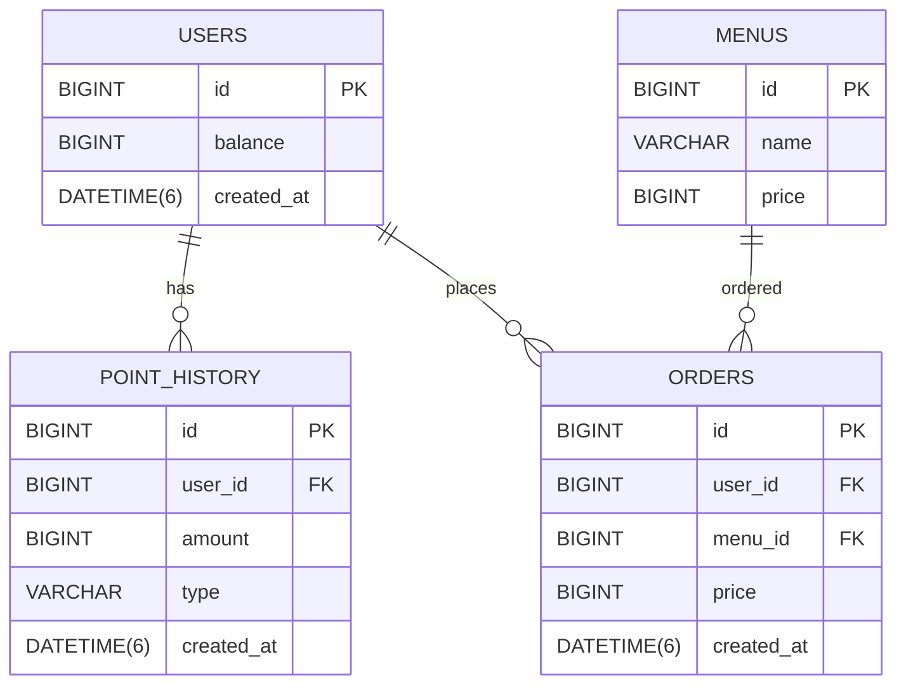

# 커피숍 주문 시스템

다수 서버·다수 인스턴스 환경에서도 포인트와 주문의 정합성을 지키는 커피 주문 시스템입니다.
K사 서버 개발 사전과제의 필수 API 4개를 구현하고, 각 설계 선택을 실제 MySQL 테스트로 검증하는 것을 목표로 합니다.

> 현재 상태: 필수 API 4개(메뉴 조회, 포인트 충전, 주문·결제, 인기 메뉴)를 모두 구현하고 실제 MySQL로 검증했습니다.

## 실행 방법

필수 환경은 Java 17과 Docker입니다.

```bash
docker compose up -d mysql redis
./gradlew bootRun
```

실행 후 다음 주소로 프로젝트 기동 상태를 확인합니다.

- Swagger UI: `http://localhost:8080/swagger-ui.html`
- OpenAPI JSON: `http://localhost:8080/v3/api-docs`

테스트는 MySQL Testcontainers를 사용하므로 Docker가 실행 중이어야 합니다.

```bash
./gradlew clean test
```

기본 DB 포트가 사용 중이면 다음처럼 변경할 수 있습니다.

```bash
DB_PORT=13306 docker compose up -d mysql redis
DB_URL=jdbc:mysql://localhost:13306/coffee ./gradlew bootRun
```

두 애플리케이션 인스턴스와 nginx gateway를 함께 실행하려면 다음 명령을 사용합니다. gateway 기본 포트는 로컬 개발 포트와 겹치지 않는 `18080`입니다.

```bash
export COMPOSE_PROJECT_NAME="coffee-order-verify-$(date +%s)"
export DB_PORT=13316
export GATEWAY_PORT=18081
export GATEWAY_URL="http://localhost:${GATEWAY_PORT}"

docker compose up -d --build --wait
./scripts/multi-instance-smoke.sh
docker compose logs nginx
docker compose down -v --remove-orphans
```

`13316`이나 `18081`을 이미 사용 중이면 각각 다른 빈 포트로 바꿉니다. 위 변수는 같은 셸에서 export한 상태로 기동·smoke·로그·종료까지 유지해야 합니다.

Smoke 자동 검증에는 `curl`, `python3`, Docker Compose가 필요합니다. 스크립트는 시작 시 공유 DB가 잔액 0P·주문 0건·이력 0건인 fresh 상태인지 먼저 확인하고, HTTP 응답 값, 개발 검증용 `X-Upstream-Addr` 헤더를 통한 두 upstream 분산, 최종 공유 DB 상태를 검사합니다. 하나라도 다르면 `SMOKE FAIL` 메시지와 비정상 종료 코드를 반환합니다. `COMPOSE_PROJECT_NAME`은 기동·smoke·로그·종료 명령에서 같은 고유 값을 사용해야 합니다.

일반 로컬 개발에서 `docker compose up -d mysql redis`로 실행한 경우 `docker compose down`을 사용하면 데이터 볼륨을 보존합니다. Redis가 중단되어도 인기 메뉴 API는 MySQL 집계로 fallback하지만, Redis read model 검증을 하려면 두 서비스를 함께 실행해야 합니다. 위의 격리된 smoke 검증은 매번 fresh DB가 필요하므로 고유 프로젝트 이름을 사용하고 반드시 `docker compose down -v --remove-orphans`로 검증 볼륨까지 정리합니다.

## 요구사항과 범위

| 기능 | API | 핵심 제약 |
|---|---|---|
| 메뉴 목록 조회 | `GET /menus` | 메뉴 ID, 이름, 가격 반환 |
| 포인트 충전 | `POST /users/{userId}/points/charge` | 1원=1P, 잔액과 충전 이력 동시 반영 |
| 주문·결제 | `POST /orders` | 포인트 차감, 주문 저장, 데이터 플랫폼 전송 |
| 인기 메뉴 조회 | `GET /menus/popular` | 최근 7일 주문 횟수 상위 3개 |

회원가입·인증, 메뉴 관리, 장바구니, 주문 취소·환불은 요구사항에 없으므로 범위에서 제외합니다. 주문 한 건은 메뉴 한 개만 포함합니다.

## 설계 의도

### 포인트: 현재 잔액과 변경 이력 분리

현재 잔액은 `users.balance`에 저장해 빠르게 조회하고, 충전·사용 내역은 `point_history`에 불변 이력으로 남깁니다. 잔액 변경과 이력 저장은 반드시 같은 트랜잭션에서 처리하며, `User`가 잔액 부족을 직접 방어합니다.

### 주문: 결제 시점 가격 보존

`orders.price`에 주문 시점의 메뉴 가격을 저장합니다. 이후 메뉴 가격이 바뀌어도 과거 결제 금액은 변하지 않습니다. 검증에 실패한 주문은 저장하지 않으므로 `존재하는 주문 = 성공한 주문`이라는 불변식을 유지합니다.

### 동시성: 공유 MySQL의 사용자 행 잠금

동일 사용자의 충전과 주문이 동시에 실행될 때 잔액을 안전하게 변경하기 위해 MySQL 비관적 락을 기본안으로 사용합니다. JVM 로컬 락이나 인스턴스 메모리에 의존하지 않아 여러 애플리케이션 인스턴스에서도 같은 정합성 기준을 적용합니다.

### 인기 메뉴: MySQL 정본과 Redis ZSET read model

주문 원본과 정확성의 기준은 계속 MySQL입니다. 성공한 주문이 커밋된 뒤 `popular:menus:{menuId}:orders` Redis ZSET에 주문 ID를 member로 추가하고, 주문 시각의 UTC epoch microsecond를 score로 저장합니다. 조회 시 각 메뉴의 `[to - 7일, to)` 구간을 `ZCOUNT`하여 최근 주문 수를 계산하므로 날짜 버킷 경계가 틀어지지 않습니다. Redis 연결이나 갱신에 실패하면 기존 MySQL `GROUP BY` 집계로 fallback합니다. Redis를 포인트·주문 정본이나 분산 락으로 사용하지 않습니다.

### 외부 전송: 커밋 후 비동기 처리

주문·차감·이력을 먼저 커밋한 뒤 `AFTER_COMMIT` 이벤트를 비동기로 처리해 Mock 데이터 플랫폼으로 전송합니다. 외부 장애는 성공한 결제를 롤백하지 않지만, 현재는 재시도할 영속 이벤트가 없어 프로세스 종료나 전송 실패 시 유실될 수 있습니다. 전송 보장 요구가 생기면 Outbox를 검토합니다.

## 데이터 모델



컬럼과 제약의 상세 내용은 [테이블 명세](docs/table-spec.md)를 참고합니다.

## 문제 해결 전략

1. 가장 단순한 API부터 수직으로 구현해 공통 구조를 검증합니다.
2. 포인트 충전과 주문에 동시 요청 테스트를 작성해 경쟁 조건을 재현합니다.
3. 비관적 락 적용 전후의 결과를 동일한 MySQL 테스트로 비교합니다.
4. 주문·차감·이력 저장 중 하나가 실패할 때 전체가 롤백되는지 검증합니다.
5. 외부 API 지연·실패를 재현한 뒤 전송 방식의 트레이드오프를 확정합니다.
6. 인기 메뉴는 Redis ZSET의 기간 경계·커밋 후 반영·장애 fallback과 MySQL 집계의 실행 계획을 함께 검증합니다.

기능은 `Plan → Issue → Branch → Manifest → Prepare → Generate → Evaluate → Explain → Publish` 순서로 진행합니다. 새 manifest는 `harness/plans/issue-<issue>-<slug>.json`을 사용하고, `python3 scripts/agent-publish.py ...`가 최신 `PASS`를 확인한 뒤 Ready PR과 `Closes #<issue>`를 연결합니다. `--merge`를 명시한 경우에만 required checks, PR `MERGED`, 이슈 `CLOSED`까지 확인합니다.

## 기술 선택

| 항목 | 선택 | 이유 |
|---|---|---|
| 언어·프레임워크 | Java 17, Spring Boot | 익숙한 스택으로 트랜잭션과 동시성 학습에 집중 |
| 데이터베이스 | MySQL | 공유 정본, 트랜잭션과 비관적 락 지원 |
| 데이터 접근 | Spring Data JPA | 기본 영속성 구현과 선언적 비관적 락 사용 |
| 마이그레이션 | Flyway | 스키마와 초기 메뉴 데이터를 재현 가능하게 관리 |
| 테스트 | JUnit 5, Testcontainers MySQL | 실제 DB의 락·제약·트랜잭션 동작 검증 |
| API 문서 | springdoc-openapi | 구현과 API 문서의 차이 축소 |
| 인기 메뉴 read model | Redis ZSET | 최근 7일 주문 시각을 score로 저장해 정확한 기간 집계와 빠른 메뉴별 count를 제공 |
| 다중 인스턴스 | Docker Compose, nginx, Redis | 동일 앱 2개가 공유 MySQL·Redis 상태를 사용하도록 실제 검증 |

## 검증 기준

- 메뉴 조회의 정상 응답과 정렬
- 정상 충전, 0 이하 충전, 없는 사용자
- 정상 주문, 포인트 부족, 없는 메뉴·사용자
- 동일 사용자 동시 충전·주문 후 정확한 잔액과 이력
- 주문 처리 중 예외 발생 시 주문·잔액·이력 전체 롤백
- 외부 전송 지연·실패가 결제에 미치는 영향
- 인기 메뉴의 7일 경계, 주문 횟수, 동률 순서
- 주문 커밋 후 Redis 반영과 실패 주문 미반영
- Redis 장애 시 MySQL fallback
- 다중 인스턴스에서 동일한 공유 DB 상태 확인

## 문서

- [설계 의도·문제 해결 전략](docs/strategy.md)
- [도메인 흐름 컨텍스트 맵](docs/context-map.md)
- [테이블 명세](docs/table-spec.md)
- [API 명세](docs/api-spec.md)
- [도메인 정책](docs/rules/policy.md)
- [개발·검증 흐름](docs/rules/workflow.md)
- [AI 작업 오케스트레이션 계약](docs/ai/orchestration-policy.md)
- [실행 증거](docs/logs/README.md)

## 진행 상태

- [x] 요구사항 해석과 설계 초안
- [x] Spring Boot 프로젝트 스캐폴딩
- [x] 프로젝트 셋업 최종 검증
- [x] 메뉴 목록 조회
- [x] 포인트 충전과 동시성 검증
- [x] 주문·결제와 외부 전송 검증
- [x] 인기 메뉴 조회
- [x] 인기 메뉴 Redis ZSET read model과 fallback 검증
- [x] 다중 인스턴스 검증
- [x] README와 구현 최종 동기화
