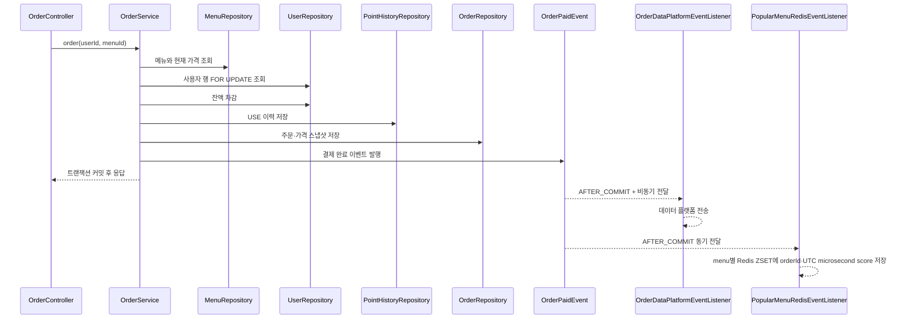
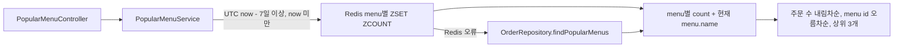

# 컨텍스트 맵: 도메인 흐름과 변경 영향

이 문서는 여러 도메인에 걸친 변경의 영향 범위를 찾기 위한 지도입니다. API 계약은 [`api-spec.md`](api-spec.md), 불변식과 미확정 정책은 [`rules/policy.md`](rules/policy.md)를 기준으로 합니다.

## 모듈 책임

| 모듈 | 소유 데이터·책임 | 직접 의존 |
|---|---|---|
| `domain/menu` | 메뉴 이름과 현재 가격, 목록 조회 | 없음 |
| `domain/user` | 사용자 현재 포인트 잔액과 행 잠금 조회 | 없음 |
| `domain/point` | 포인트 충전·사용 이력 | `domain/user` |
| `domain/order` | 주문 시점 가격 스냅샷, 결제 트랜잭션, 결제 완료 이벤트 | `menu`, `user`, `point` |
| `domain/ranking` | 최근 7일 주문 집계와 상위 3개 조회 | `order`, `menu`, Redis read model port |
| `infra/dataplatform` | 커밋된 주문의 외부 데이터 플랫폼 전송 | `order`의 이벤트·포트 |
| `infra/redis` | 커밋된 주문의 인기 메뉴 ZSET read model 반영·조회 | `domain/ranking`의 port, `order` 이벤트 |
| `global` | 공통 시간, 응답, 예외 변환 | 모든 API 계층 |

## 주문에서 외부 전송까지

- `OrderService.order()` 하나의 트랜잭션에서 잔액, 사용 이력, 주문을 함께 변경합니다.
- 커밋 전 예외가 발생하면 세 DB 변경은 모두 롤백되고 `AFTER_COMMIT` 리스너는 실행되지 않습니다.
- 외부 전송은 커밋 이후 비동기로 실행됩니다. 전송 실패는 이미 커밋된 주문을 롤백하지 않으며 현재 구현은 경고 로그만 남깁니다.
- 커밋 전 예외에서는 랭킹 리스너가 실행되지 않아 실패한 주문이 Redis에 반영되지 않습니다.
- Redis가 정상인 경우 인기 메뉴는 menu별 ZSET의 `[to - 7일, to)` `ZCOUNT` 결과를 사용하고, Redis 오류 시 `OrderRepository.findPopularMenus`로 fallback합니다.

## 인기 메뉴 조회

랭킹 결과를 바꾸는 변경은 `domain/ranking`만 보지 말고 주문 저장 시각, `orders.created_at` 인덱스, `OrderRepository`의 집계 쿼리까지 함께 확인합니다.

## 변경 영향 체크

| 변경 | 함께 확인할 경계 | 회귀 검증 |
|---|---|---|
| 메뉴 가격·식별자 | 주문 가격 스냅샷, 인기 메뉴 조인 | 메뉴·주문·랭킹 테스트 |
| 포인트 차감·잠금 | 충전과 주문의 동일 사용자 직렬화, 이력 원자성 | 포인트·주문 동시성 테스트 |
| 주문 저장·시각 | 이벤트 발행 시점, Redis score, 7일 집계 경계, 인덱스 | 주문·랭킹·Redis·migration 테스트 |
| 이벤트·외부 전송 | `AFTER_COMMIT`, 비동기 실패 정책 | 주문 이벤트 통합 테스트 |
| 테이블·컬럼 | Flyway 순차 업그레이드, JPA 매핑, native query | `MigrationUpgradeTest`와 전체 테스트 |
