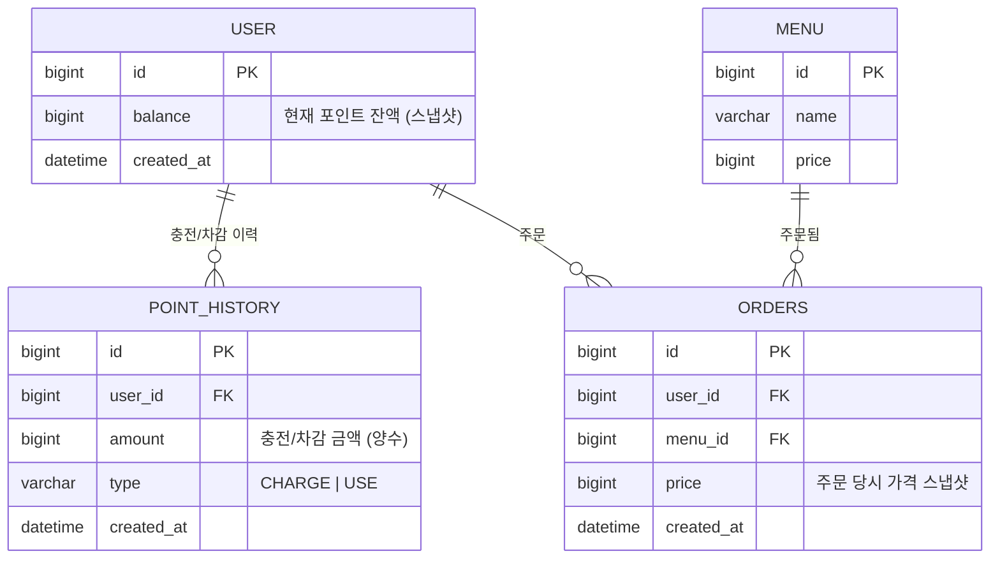

# ERD / 테이블 명세

## 다이어그램

> 테이블명은 `ORDER`가 MySQL 예약어이므로 `orders`로 명명합니다.

## 테이블 명세

### user

| 컬럼 | 타입 | 제약 | 설명 |
|---|---|---|---|
| id | BIGINT | PK, AUTO_INCREMENT | 사용자 식별값. 인증 없이 API 파라미터로 그대로 사용 |
| balance | BIGINT | NOT NULL, DEFAULT 0 | 현재 포인트 잔액 (스냅샷). 항상 0 이상 |
| created_at | DATETIME | NOT NULL, DEFAULT CURRENT_TIMESTAMP | 생성 시각 |

- **인덱스**: 없음 (PK 조회만 사용)
- **사용하는 기능**: 포인트 충전, 주문/결제, (향후) 동시성 제어 락 대상

### point_history

| 컬럼 | 타입 | 제약 | 설명 |
|---|---|---|---|
| id | BIGINT | PK, AUTO_INCREMENT | 이력 식별값 |
| user_id | BIGINT | NOT NULL, FK → user.id | 대상 사용자 |
| amount | BIGINT | NOT NULL, > 0 | 변동 금액 (항상 양수, 방향은 `type`으로 구분) |
| type | VARCHAR(10) | NOT NULL | `CHARGE`(충전) \| `USE`(주문 결제 시 사용) |
| created_at | DATETIME | NOT NULL, DEFAULT CURRENT_TIMESTAMP | 발생 시각 |

- **인덱스**: `idx_point_history_user_id_created_at (user_id, created_at)` — 사용자별 이력 조회/감사용
- **관계**: `user_id` → `user.id` (N:1)
- **사용하는 기능**: 포인트 충전(CHARGE 기록), 주문/결제(USE 기록)
- **불변식**: `user.balance` == 해당 `user_id`의 `point_history.amount` 부호 반영 합계

### menu

| 컬럼 | 타입 | 제약 | 설명 |
|---|---|---|---|
| id | BIGINT | PK, AUTO_INCREMENT | 메뉴 식별값 |
| name | VARCHAR(50) | NOT NULL | 메뉴명 |
| price | BIGINT | NOT NULL, > 0 | 현재 판매 가격 |

- **인덱스**: 없음 (전체 목록 조회만 사용, 데이터 규모가 작음)
- **사용하는 기능**: 메뉴 목록 조회, 주문/결제(가격 스냅샷 원천), 인기 메뉴 조회(메뉴명 조인)
- **비고**: 등록/수정 API 없음. Flyway 마이그레이션 시드 데이터로만 채워짐

### orders

| 컬럼 | 타입 | 제약 | 설명 |
|---|---|---|---|
| id | BIGINT | PK, AUTO_INCREMENT | 주문 식별값 |
| user_id | BIGINT | NOT NULL, FK → user.id | 주문한 사용자 |
| menu_id | BIGINT | NOT NULL, FK → menu.id | 주문한 메뉴 |
| price | BIGINT | NOT NULL | 주문 시점 `menu.price` 스냅샷 (이후 메뉴 가격 변경과 무관) |
| created_at | DATETIME | NOT NULL, DEFAULT CURRENT_TIMESTAMP | 주문(결제 완료) 시각 |

- **인덱스**: `idx_orders_menu_id_created_at (menu_id, created_at)` — 최근 7일 인기 메뉴 GROUP BY 집계용
- **관계**: `user_id` → `user.id` (N:1), `menu_id` → `menu.id` (N:1)
- **사용하는 기능**: 주문/결제, 인기 메뉴 조회
- **비고**: `status` 컬럼 없음. 검증(메뉴 존재·잔액 충분)을 통과한 경우에만 INSERT되므로 "레코드 존재 = 결제 성공"이 항상 성립

## 설계 노트

- `balance`와 `point_history` INSERT는 **하나의 트랜잭션**에서 함께 처리한다 (정합성 보장).
- `point_history`는 append-only다. 수정·삭제하지 않는다.
- 인기 메뉴 조회는 `orders`를 `menu_id`로 GROUP BY하여 집계한다 (구현 방식은 `strategy.md` 5.3 참고, 추후 변경 가능).
- 각 결정의 배경(왜 스냅샷인지, 왜 status가 없는지 등)은 `strategy.md` 2장 참고.

## 미확정 사항 (learning 후 반영 예정)

- 동시성 제어를 위해 `user.balance`에 비관적 락(`SELECT ... FOR UPDATE`) 사용 예정 — 이 경우 컬럼 추가는 불필요 (락은 쿼리 방식의 문제).
- 낙관적 락으로 전환할 경우 `user`에 `version` 컬럼이 추가될 수 있음 (현재 명세에는 미포함).
