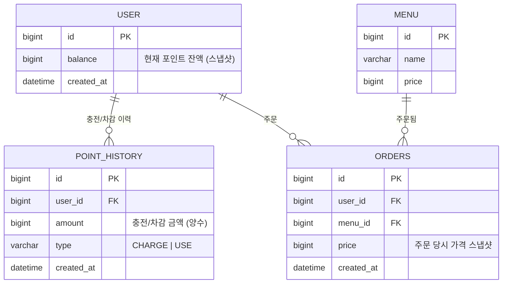

# ERD

## 다이어그램

> 테이블명은 `ORDER`가 MySQL 예약어이므로 `orders`로 명명합니다.

## 설계 노트

### User
- 별도 인증 없이 존재하는 최소 엔티티. `id`를 요청 파라미터의 사용자 식별값으로 사용합니다.
- `balance`는 항상 `PointHistory` 합계와 일치해야 하는 **스냅샷 값**입니다 (불변식: `balance == SUM(PointHistory.amount by sign)`).

### PointHistory
- 포인트 변동 이력을 append-only로 기록합니다. 수정/삭제하지 않습니다.
- `type`으로 충전(CHARGE)과 사용(USE)을 구분합니다. USE는 주문/결제 시 자동 생성됩니다.
- `balance` 갱신과 `PointHistory` INSERT는 **하나의 트랜잭션**에서 함께 처리합니다.

### Menu
- 등록/수정 API가 없으므로 Flyway 마이그레이션 시드 데이터로만 채워집니다.

### Orders (구 Order)
- 검증(메뉴 존재 여부, 포인트 충분 여부)을 통과한 경우에만 레코드가 생성됩니다. 따라서 `status` 컬럼이 없으며, "레코드 존재 = 결제 성공"이 항상 성립합니다.
- `price`는 주문 시점 `Menu.price`의 스냅샷이며, 이후 메뉴 가격이 바뀌어도 값이 변하지 않습니다.
- 인기 메뉴 조회는 최근 7일간 `orders`를 `menu_id`로 GROUP BY하여 집계합니다 (구현 방식은 `strategy.md` 5.3 참고, 추후 변경 가능).

## 미확정 사항 (learning 후 반영 예정)
- 동시성 제어를 위해 `User.balance`에 비관적 락(`SELECT ... FOR UPDATE`) 사용 예정 — 이 경우 컬럼 추가는 불필요 (락은 쿼리 방식의 문제).
- 만약 낙관적 락으로 전환할 경우 `User`에 `version` 컬럼이 추가될 수 있음 (현재 ERD에는 미포함).
